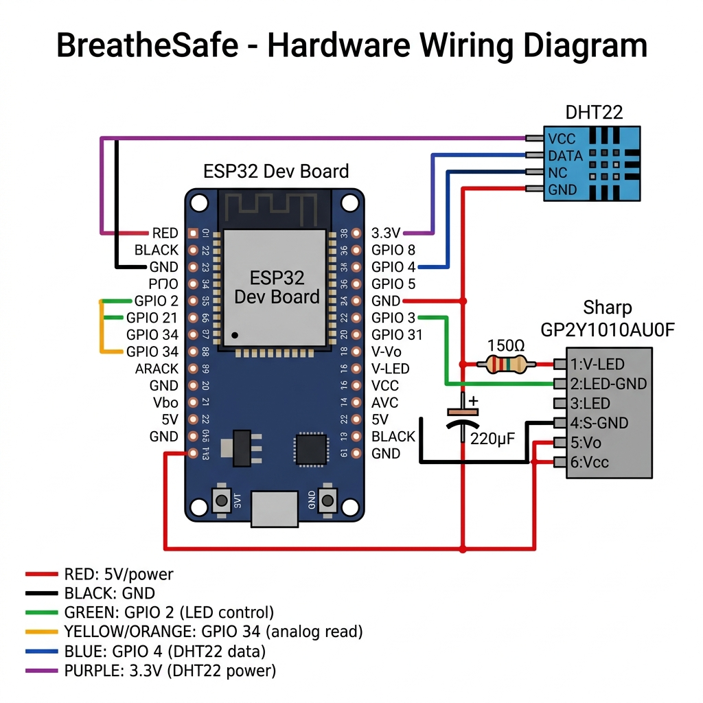

# 🔌 Hardware Connection Guide

This guide explains exactly how to wire up the **BreatheSafe ESP32 hardware** with the **Sharp GP2Y1010AU0F** optical dust sensor and **DHT22** temperature/humidity sensor.

---

## 📸 Wiring Diagram



---

## 🧰 Components Required

| Component | Quantity | Notes |
|---|---|---|
| ESP32 Dev Board (ESP32-WROOM-32) | 1 | Any standard ESP32 Dev Module works |
| Sharp GP2Y1010AU0F Optical Dust Sensor | 1 | The 6-pin JST connector version |
| DHT22 Temperature & Humidity Sensor | 1 | Also sold as AM2302 |
| 150Ω Resistor | 1 | For Sharp sensor IR LED |
| 220µF Electrolytic Capacitor | 1 | For Sharp sensor IR LED power stability |
| 10kΩ Resistor | 1 | Pull-up for DHT22 data line |
| Breadboard | 1 | For prototyping |
| Jumper Wires | ~15 | Male-to-male |
| Micro-USB Cable | 1 | For programming the ESP32 |

---

## 🔗 Sharp GP2Y1010AU0F → ESP32 Connections

The Sharp sensor has **6 pins** (numbered 1 to 6 on the connector). Wire them as follows:

| Sharp Pin | Pin Label | ESP32 Connection | Wire Color | Notes |
|:---:|---|---|---|---|
| **1** | V-LED | **5V** (via 150Ω resistor) | 🔴 Red | Series 150Ω resistor required. Add 220µF cap between this pin and GND |
| **2** | LED-GND | **GND** | ⚫ Black | Ground for internal IR LED |
| **3** | LED | **GPIO 2** | 🟢 Green | Digital control pin — turns IR LED on/off during measurement |
| **4** | S-GND | **GND** | ⚫ Black | Ground for signal/output circuit |
| **5** | Vo | **GPIO 34** | 🟡 Yellow | Analog output — connect to ADC input pin |
| **6** | Vcc | **5V** | 🔴 Red | Main power for sensor |

> **⚠️ IMPORTANT — The 150Ω Resistor + 220µF Capacitor:**
> These are **not optional**. The Sharp sensor's internal IR LED pulses at high current. Without the resistor and capacitor:
> - The ESP32's 5V rail can brown out
> - Readings will be unstable or always zero
>
> Connect them like this: `ESP32 5V → [150Ω resistor] → Sharp Pin 1 (V-LED)`
> And: `Sharp Pin 1 ←→ [220µF capacitor (+)] → GND`

---

## 🌡️ DHT22 → ESP32 Connections

The DHT22 has **4 pins** (numbered 1 to 4 from left to right when facing the sensor grid):

| DHT22 Pin | Pin Label | ESP32 Connection | Wire Color | Notes |
|:---:|---|---|---|---|
| **1** | VCC | **3.3V** | 🟣 Purple | Do not use 5V — will damage the sensor |
| **2** | DATA | **GPIO 4** | 🔵 Blue | Add a 10kΩ pull-up resistor between DATA and 3.3V |
| **3** | NC | Not connected | — | Leave this pin floating |
| **4** | GND | **GND** | ⚫ Black | Ground |

> **💡 Pull-up Resistor:** Connect a **10kΩ resistor** between the DATA pin (pin 2) and the 3.3V pin (pin 1) on the DHT22 side. Without it, the DHT22 will fail to send data.

---

## 📋 Full Pinout Summary

```
ESP32 Dev Board
│
├── 5V  ──── [150Ω] ──── Sharp Pin 1 (V-LED)
│                  └── [220µF cap to GND]
├── 5V  ──────────────── Sharp Pin 6 (Vcc)
├── GND ──────────────── Sharp Pin 2 (LED-GND)
├── GND ──────────────── Sharp Pin 4 (S-GND)
├── GPIO 2 ───────────── Sharp Pin 3 (LED) ← IR LED control
├── GPIO 34 ──────────── Sharp Pin 5 (Vo) ← Analog dust reading
│
├── 3.3V ─────────────── DHT22 Pin 1 (VCC)
├── 3.3V ──── [10kΩ] ─── DHT22 Pin 2 (DATA) ← pull-up
├── GPIO 4 ───────────── DHT22 Pin 2 (DATA) ← data line
└── GND  ─────────────── DHT22 Pin 4 (GND)
```

---

## 💡 How the Sharp Sensor Works

The Sharp GP2Y1010AU0F is an **optical particle sensor**, not a gas sensor. Inside it has:
- An **infrared LED** that pulses briefly
- A **phototransistor** that detects light scattered by dust particles

The ESP32 firmware controls this timing precisely:
1. Pull `GPIO 2` LOW → IR LED turns ON
2. Wait **280 µs** → sensor output settles
3. Read analog value from `GPIO 34` → this is the dust reading
4. Wait **40 µs** more
5. Pull `GPIO 2` HIGH → IR LED turns OFF
6. Wait **9680 µs** (rest of the 10ms cycle)

The raw analog reading (0–4095 on 12-bit ADC) is converted to a voltage, then to **dust density in µg/m³** using this formula:

```
Voltage = raw_adc * (3.3 / 4095.0)
Dust_mg_per_m3 = (0.17 * Voltage) - 0.1
Dust_µg_per_m3 = Dust_mg_per_m3 * 1000
```

> Clean air reads typically **0–35 µg/m³**. WHO standard for healthy PM2.5 is **< 25 µg/m³** annual mean.

---

## 📡 BLE Data Format

The ESP32 sends sensor data over BLE every 1 second as a comma-separated string:

```
dustDensity,humidity,temperature,dhtValid
```

**Example:** `12.5,55.3,24.7,1`

| Field | Description | Unit |
|---|---|---|
| `dustDensity` | Particulate matter (PM2.5 estimate) | µg/m³ |
| `humidity` | Relative humidity from DHT22 | % |
| `temperature` | Air temperature from DHT22 | °C |
| `dhtValid` | 1 = DHT22 reading valid, 0 = failed | — |

---

## 🔧 Flashing the ESP32 Firmware

1. Install the [Arduino IDE](https://www.arduino.cc/en/software) (v2.x recommended)
2. Add the ESP32 board package: `https://raw.githubusercontent.com/espressif/arduino-esp32/gh-pages/package_esp32_index.json`
3. Install the **DHT sensor library** by Adafruit via Library Manager
4. Open `esp32_firmware/esp32_firmware.ino`
5. Select **Board:** `ESP32 Dev Module`
6. Select your COM/tty port
7. Click **Upload**
8. Open Serial Monitor at **115200 baud** to verify readings

---

## ✅ Verification Checklist

Before connecting to the app:
- [ ] All GND connections share a common ground on the breadboard
- [ ] 150Ω resistor is in series between 5V and Sharp pin 1
- [ ] 220µF capacitor is correctly polarised (+ to Sharp pin 1 side)
- [ ] 10kΩ pull-up resistor on DHT22 data line
- [ ] ESP32 Serial Monitor shows dust readings and temperature/humidity
- [ ] BLE device `BreatheSafe_Device` appears in a BLE scanner app

---

## 🚨 Troubleshooting

| Symptom | Likely Cause | Fix |
|---|---|---|
| Dust always reads 0 or negative | Missing/wrong resistor or capacitor | Check 150Ω resistor and 220µF cap wiring |
| DHT22 shows `NaN` | Missing pull-up resistor | Add 10kΩ between DATA and 3.3V |
| BLE not found | Wrong board settings or firmware not uploaded | Re-upload firmware, check board selected as ESP32 Dev Module |
| App shows "Disconnected" | ESP32 powered off or out of range | Check USB power, move device closer |
